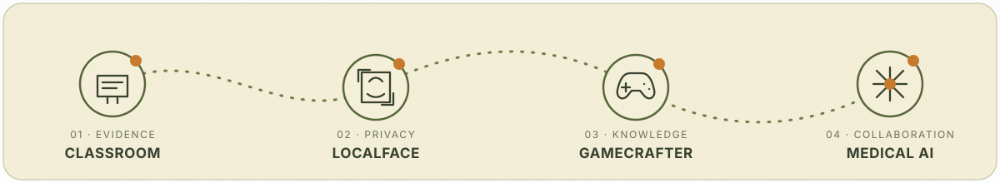

  

<h1 align="center">WENQI'S AI WILDLAND</h1>

  <strong>雯琪的智能荒野</strong> 
  <em>Agents grow here — from rough ideas into living systems.</em> 
  让想法野蛮生长，让智能真正运行。

  AI Agent & Applied AI Engineer · NTU MComp in Applied Artificial Intelligence

  <a href="mailto:wenqi.77.zhang@gmail.com">Email</a>
  ·
  <a href="https://github.com/Wenqi77Zhang?tab=repositories">Repositories</a>

---

### A small note from the wild

I build AI systems that can leave the demo and enter a real workflow: they gather evidence, make their reasoning reviewable, invite human decisions, and improve through iteration.

我关注的不只是模型能否给出答案，也关注答案从哪里来、如何被验证，以及它能否真正进入课堂、创作、游戏与医疗等真实场景。

- 🌱 Building with **AI agents, LLM applications, RAG, multimodal AI and computer vision**
- 🧭 Interested in **human-in-the-loop systems, evidence provenance, privacy and product engineering**
- 🎓 Studying **Master of Computing in Applied Artificial Intelligence** at Nanyang Technological University
- 🔭 Open to **Applied AI / AI Agent / Machine Learning Engineering internships**

  

## Field Notes · Featured Projects

<table>
  <tr>
    <td width="50%" valign="top">
      FIELD NOTE 01 · CLASSROOM INTELLIGENCE
      <h3><a href="https://github.com/Wenqi77Zhang/classroom-review-analysis-agent">Classroom Review Analysis Agent</a></h3>
      
An evidence-grounded classroom review system that turns video, slides and transcripts into timestamped teaching insights, with teacher review before report generation.

      
<strong>Early-stage team build · NetEase Youdao AI Capstone</strong>

      
<code>Next.js</code> <code>Python</code> <code>Agent workflow</code> <code>Multimodal evidence</code>

    </td>
    <td width="50%" valign="top">
      FIELD NOTE 02 · PRIVATE CREATIVE AI
      <h3><a href="https://github.com/Wenqi77Zhang/localface-studio">LocalFace Studio</a></h3>
      
A privacy-first, fully local web application for precise single-photo face editing, designed around replaceable inference backends, safe local data boundaries and transparent AI-edit metadata.

      
<strong>Phase 1 complete · Product loop in progress</strong>

      
<code>Python</code> <code>ONNX</code> <code>Web UI</code> <code>Privacy by design</code>

    </td>
  </tr>
  <tr>
    <td width="50%" valign="top">
      FIELD NOTE 03 · GAMES &amp; CREATIVE SYSTEMS
      <h3><a href="https://github.com/Wenqi77Zhang/GameCrafter-Agent">GameCrafter</a></h3>
      
An evidence-aware game knowledge and marketing workspace for indie developers: traceable source ingestion, human-reviewed knowledge, real market signals and controlled Agent workflows.

      
<strong>Active long-term build · M1-C knowledge contracts</strong>

      
<code>FastAPI</code> <code>React</code> <code>PostgreSQL</code> <code>pgvector</code> <code>Agent systems</code>

    </td>
    <td width="50%" valign="top">
      FIELD NOTE 04 · MEDICAL AI
      <h3><a href="https://github.com/pappylon/Multi-MedAgent">Multi-MedAgent</a></h3>
      
A collaborative medical-AI project exploring model-assisted consultation. The current system combines medical RAG, local-model integration and an interactive Streamlit experience.

      
<strong>Team contributor · Collaborative repository</strong>

      
<code>LangChain</code> <code>RAG</code> <code>Transformers</code> <code>ChromaDB</code> <code>Streamlit</code>

    </td>
  </tr>
</table>

## The tools growing in this field

| Area | Working toolkit |
|---|---|
| **Languages & data** | Python · TypeScript · JavaScript · SQL · HTML/CSS |
| **Applied AI** | LLM applications · RAG · Agent workflows · prompt engineering · computer vision · multimodal pipelines |
| **Models & libraries** | PyTorch · Transformers · LangChain · sentence-transformers · ONNX |
| **Product systems** | FastAPI · React · Next.js · Streamlit · PostgreSQL · pgvector · ChromaDB |
| **Engineering practice** | Git/GitHub · Docker · CI · testing · data provenance · privacy-aware design |
| **Creative workflows** | ComfyUI · AI video workflow design · topic mining · short-form video production |

## More paths through the wild

- **[AssignmentPilot](https://github.com/Wenqi77Zhang/AI-Agent-for-Coursework-Planning-and-Learning-Supervision)** — coursework planning and learning-supervision Agent; team-project development archive.
- **[Chest X-ray Classification Pipeline](https://github.com/Kerr-wang0213/medAgent_chest_xray)** — team-built ResNet-18 pipeline covering simulated data corruption, cleaning, training, validation and evaluation.
- **Medical RAG & model experiments** — retrieval, local model inference, fine-tuning experiments and medical-assistant interaction design within the Multi-MedAgent collaboration.

## Signals from the field

  
  

  Public-repository statistics are generated dynamically and may occasionally be unavailable when the third-party card service is rate-limited.

---

  <em>Still growing. Carefully sourced. Human reviewed.</em> 
  <a href="mailto:wenqi.77.zhang@gmail.com">wenqi.77.zhang@gmail.com</a>

