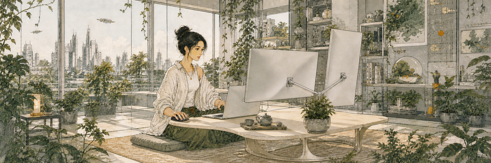
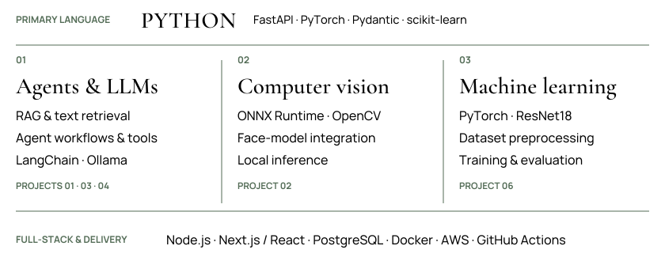
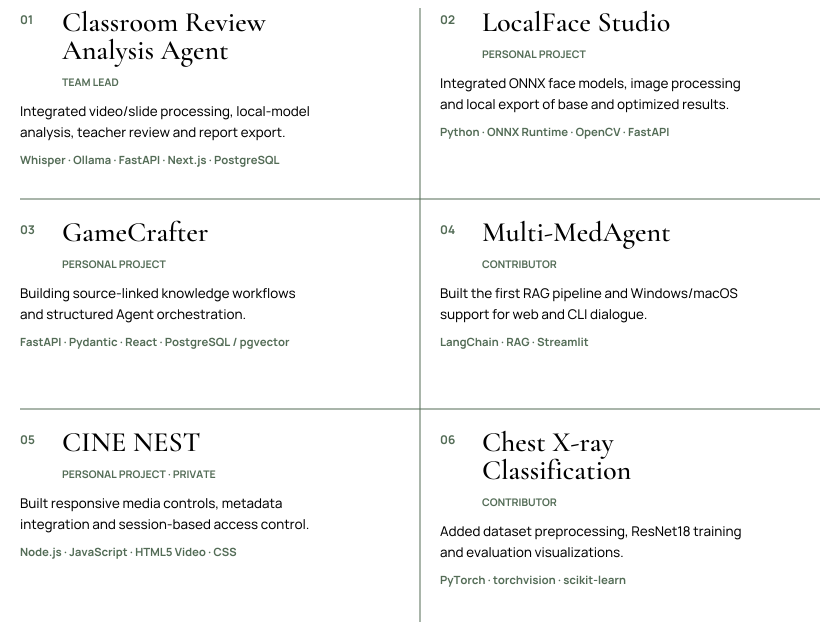

<samp>APPLIED AI ENGINEERING</samp>

  

  <strong>AI Agents · Computer Vision · Machine Learning</strong> 
  NTU · MComp in Applied Artificial Intelligence

  <a href="mailto:ZH0037QI@e.ntu.edu.sg">Email ↗</a>
  &nbsp; / &nbsp;
  <a href="https://www.linkedin.com/in/wenqi77zhang/">LinkedIn ↗</a>
  &nbsp; / &nbsp;
  <a href="https://github.com/Wenqi77Zhang?tab=repositories">Repositories ↗</a>

  

 

  

  <picture>
    <source media="(max-width: 600px)" srcset="./assets/technical-profile-mobile.svg" />
    
  </picture>

 

  

 

  <picture>
    <source media="(max-width: 600px)" srcset="./assets/selected-work-grid-mobile.svg" />
    
  </picture>

  
    <strong>01</strong> <a href="https://github.com/Wenqi77Zhang/classroom-review-analysis-agent">Repository ↗</a> · <a href="https://github.com/Wenqi77Zhang/classroom-review-analysis-agent/blob/main/reports/group-report.md">Contribution audit ↗</a> · <a href="https://github.com/Wenqi77Zhang/classroom-review-analysis-agent/blob/main/docs/aws-deployment.md">AWS deployment ↗</a> 
    <strong>02</strong> <a href="https://github.com/Wenqi77Zhang/localface-studio">Repository ↗</a> · <a href="https://github.com/Wenqi77Zhang/localface-studio/blob/main/docs/benchmarking/MODEL_MATRIX_2026_09.md">Model evaluation ↗</a>
    &nbsp; / &nbsp;
    <strong>03</strong> <a href="https://github.com/Wenqi77Zhang/GameCrafter-Agent">Repository ↗</a> · <a href="https://github.com/Wenqi77Zhang/GameCrafter-Agent/pull/23">Creative workflow ↗</a> 
    <strong>04</strong> <a href="https://github.com/pappylon/Multi-MedAgent">Repository ↗</a> · <a href="https://github.com/pappylon/Multi-MedAgent/commit/d959ff8cc0964d6774cdf63c4c84f3665f39c2a9">RAG contribution ↗</a>
    &nbsp; / &nbsp;
    <strong>05</strong> Private repository
    &nbsp; / &nbsp;
    <strong>06</strong> <a href="https://github.com/Kerr-wang0213/medAgent_chest_xray">Repository ↗</a> · <a href="https://github.com/Kerr-wang0213/medAgent_chest_xray/commit/94f40cc9f7538cdf7799709e35ba70f5ba140021">Training contribution ↗</a>
  

 

  

  <picture>
    <source media="(max-width: 600px)" srcset="./assets/open-to-roles-mobile.svg" />
    
  </picture> 
  <a href="mailto:ZH0037QI@e.ntu.edu.sg">Get in touch ↗</a>

